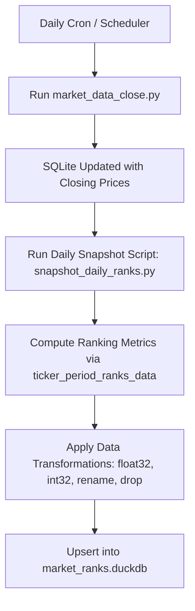

# Implementation Plan: Daily Price Rank Snapshots in DuckDB

This document outlines the architectural design, schema definition, data transformation pipeline, and integration strategy for persisting daily snapshots of ticker price ranking metrics into an embedded **DuckDB** database.

---

## 1. Executive Summary & Objective

The current market data system calculates multi-period statistical rankings (overall return, volatility, risk-reward ratio, relative strength, probability of a green day, stretch score, and Kelly criterion bet sizing) in-memory via `portfolio/ticker_period_ranks_data.py`. While daily price bars are stored in SQLite (`market_data_close`), historical ranking snapshots are currently ephemeral.

### Key Goals
- **Historical Point-in-Time Tracking:** Preserve daily calculated rankings and statistical indicators to evaluate how stock ranks evolve over time.
- **Analytical Performance:** Use **DuckDB** as a high-performance, columnar embedded OLAP database optimized for complex aggregation and analytical time-series queries.
- **Space & Memory Optimization:** Downcast data types (e.g., `float32`, `int32`), drop transient metadata, and sanitize column names for SQL compliance.
- **Idempotency & Data Integrity:** Ensure repeated daily runs replace or upsert data without creating duplicate records for the same snapshot date.

---

## 2. Data Preparation & Transformation Pipeline

Before inserting the calculated daily ranking DataFrame into DuckDB, we apply explicit data sanitization, downcasting, and schema formatting.

### Transformation Logic

#### Option A: Single-Period Snapshot (Drops Period & Date Range)
*Use this option only if snapshotting strictly the 'Daily' period table in isolation:*
```python
import datetime
import pandas as pd

# Assuming 'df' is your calculated dataframe filtered strictly for 'Daily'

# 1. Create a proper snapshot date (e.g., today's date)
df['snapshot_date'] = pd.to_datetime(datetime.date.today())

# 2. Convert string metrics to floats (float32 saves space)
float_cols = [
    'over_pc', 'pc_mean', 'pc_std', 'risk_reward', 
    'rel_strength_ind', 'prob_green_day_%', 'stretch_score', 'kelly_fraction'
]
df[float_cols] = df[float_cols].astype('float32')

# 3. Clean up ranks (convert 346.0 to an integer of 346)
rank_cols = [
    'risk_reward_rank', 'rel_strength_ind_rank', 
    'prob_green_day_rank', 'stretch_score_rank', 'kelly_fraction_rank'
]
df[rank_cols] = df[rank_cols].astype('int32')

# 4. Rename problematic columns and drop redundant ones
df = df.rename(columns={'prob_green_day_%': 'prob_green_day_pct'})
df = df.drop(columns=['Period', 'Date Range'])
```

#### Option B (Recommended): Multi-Period Snapshot (Preserves Period & Parsed Date Range)
*Captures all 5 calculation horizons (Daily, 1 Week, 2 Weeks, 1 Month, 2 Months) without row collisions:*
```python
import datetime
import pandas as pd

# 'df' contains all 5 periods from get_all_periods_ranked()

# 1. Create snapshot date
df['snapshot_date'] = pd.to_datetime(datetime.date.today())

# 2. Downcast metrics to float32
float_cols = [
    'over_pc', 'pc_mean', 'pc_std', 'risk_reward', 
    'rel_strength_ind', 'prob_green_day_%', 'stretch_score', 'kelly_fraction'
]
df[float_cols] = df[float_cols].astype('float32')

# 3. Clean up ranks to int32
rank_cols = [
    'risk_reward_rank', 'rel_strength_ind_rank', 
    'prob_green_day_rank', 'stretch_score_rank', 'kelly_fraction_rank'
]
df[rank_cols] = df[rank_cols].fillna(0).astype('int32')

# 4. Rename prob_green_day_% and Period
df = df.rename(columns={'prob_green_day_%': 'prob_green_day_pct', 'Period': 'period'})

# 5. Parse 'Date Range' ('YYYY-MM-DD to YYYY-MM-DD') into explicit start_date and end_date
# Preserves the exact historical market calendar window (cannot be derived dynamically due to NYSE holidays)
if 'Date Range' in df.columns:
    date_parts = df['Date Range'].str.split(' to ', expand=True)
    df['start_date'] = pd.to_datetime(date_parts[0]).dt.date
    df['end_date'] = pd.to_datetime(date_parts[1]).dt.date
    df = df.drop(columns=['Date Range'])

# 6. Explicitly record sampling parameters (sample_interval and num_samples)
# Crucial for statistical auditability (degrees of freedom for mean/variance) and parameter drift protection
period_sampling_map = {
    'Daily':    {'sample_interval': '1_day',   'num_samples': 10},
    '1 Week':   {'sample_interval': '1_week',  'num_samples': 6},
    '2 Weeks':  {'sample_interval': '2_weeks', 'num_samples': 6},
    '1 Month':  {'sample_interval': '1_month', 'num_samples': 6},
    '2 Months': {'sample_interval': '2_months','num_samples': 6},
}
df['sample_interval'] = df['period'].map(lambda p: period_sampling_map.get(p, {}).get('sample_interval', 'unknown'))
df['num_samples'] = df['period'].map(lambda p: period_sampling_map.get(p, {}).get('num_samples', 0)).astype('int16')
```

### Transformation Breakdown & Rationale

| Step | Action | Rationale | Edge Cases & Mitigations |
| :--- | :--- | :--- | :--- |
| **1. Snapshot Date** | Add `snapshot_date` (`DATE`) | Serves as the primary temporal partition key. Queries partition or slice by this date. | Ensure timezone consistency (use NYSE market close date rather than host local midnight). |
| **2. Float Downcasting** | Cast metrics to `float32` | Standard `float64` consumes 8 bytes/cell. `float32` uses 4 bytes (50% storage reduction) while retaining ~7 decimal digits of precision. | Guard against `NaN` or `inf` before casting if metric division by zero occurred. |
| **3. Rank Cleanup** | Cast ranks to `int32` | Default Pandas `.rank()` outputs float numbers (`346.0`). Discrete integer values save space and allow clean SQL matching. | If any ranks contain `NaN` due to missing pricing history, use `df[rank_cols].fillna(0).astype('int32')`. |
| **4. Column Sanitization** | Rename `prob_green_day_%` to `prob_green_day_pct` | SQL identifier rules: Special characters (`%`, `#`, spaces) require awkward bracket/quote escaping (`"prob_green_day_%"`). Sanitizing to snake_case allows standard unquoted SQL. | Update any frontend/API consumer mappings to reflect `prob_green_day_pct`. |
| **5. Period & Date Range Handling** | **CRITICAL**: Do **NOT** drop `Period` or `Date Range` | **Why it cannot be dropped or dynamically derived:**<br>1. **Multi-Period Granularity:** Each ticker has metrics across 5 historical periods (`Daily` [10 business days], `1 Week` [6 weeks], `2 Weeks` [6 fortnights], `1 Month` [6 months], `2 Months` [6 bi-months]). Dropping `Period` collides 5 rows per ticker on the same snapshot date.<br>2. **Non-Uniform Market Calendars:** `Date Range` spans `date_oldest` to `date_newest`. Because trading schedules involve irregular NYSE holidays, closures, and variable business-day offsets, `Date Range` **cannot be dynamically derived in SQL** from `snapshot_date` without external market calendar logic.<br><br>**Action:**<br>• Keep `period VARCHAR`.<br>• Split `Date Range` into `start_date DATE` and `end_date DATE`. | Include `period` in the primary key: `PRIMARY KEY (snapshot_date, period, ticker)`. |
| **6. Sampling Metadata** | Add `sample_interval` and `num_samples` | **Why this is essential:**<br>• **Statistical Validity:** `pc_mean` and `pc_std` are sample statistics. Degrees of freedom ($N-1$ or $N-2$) depend on `num_samples` (e.g. $N=10$ daily steps vs $N=6$ monthly steps).<br>• **Parameter Drift Protection:** If sampling parameters change in code in the future (e.g. 20 daily days instead of 10), historical data remains accurately self-describing.<br>• **Zero Overhead:** Stored as `VARCHAR` (dictionary encoded) and `SMALLINT` (2 bytes) in DuckDB. | Default unknown periods gracefully to `num_samples = 0`. |

---

## 3. DuckDB Target Schema

### Table: `daily_price_ranks`

```sql
CREATE TABLE IF NOT EXISTS daily_price_ranks (
    snapshot_date           DATE NOT NULL,
    period                  VARCHAR NOT NULL, -- 'Daily', '1 Week', '2 Weeks', '1 Month', '2 Months'
    ticker                  VARCHAR NOT NULL,
    start_date              DATE,             -- Oldest trading date in the calculation window
    end_date                DATE,             -- Newest trading date in the calculation window
    sample_interval         VARCHAR,          -- Step size: '1_day', '1_week', '2_weeks', '1_month', '2_months'
    num_samples             SMALLINT,         -- Observation count: 10, 6, 6, 6, 6
    sector                  VARCHAR,
    industry                VARCHAR,
    over_pc                 FLOAT,            -- Overall return %
    pc_mean                 FLOAT,            -- Mean return % over period steps
    pc_std                  FLOAT,            -- Volatility / StdDev %
    risk_reward             FLOAT,            -- Mean / StdDev ratio
    rel_strength_ind        FLOAT,            -- Relative strength vs industry
    prob_green_day_pct      FLOAT,            -- Prob of positive return (%)
    stretch_score           FLOAT,            -- over_pc / pc_std
    kelly_fraction          FLOAT,            -- pc_mean / (pc_std^2)
    risk_reward_rank        INTEGER,          -- Rank within period (1 = best)
    rel_strength_ind_rank   INTEGER,          -- Rank within period (1 = best)
    prob_green_day_rank     INTEGER,          -- Rank within period (1 = best)
    stretch_score_rank      INTEGER,          -- Rank within period (1 = best)
    kelly_fraction_rank     INTEGER,          -- Rank within period (1 = best)
    created_at              TIMESTAMP DEFAULT CURRENT_TIMESTAMP,
    PRIMARY KEY (snapshot_date, period, ticker)
);

-- Recommended Index for historical ticker lookup across periods
CREATE INDEX IF NOT EXISTS idx_daily_price_ranks_ticker ON daily_price_ranks (ticker, period, snapshot_date);
```

---

## 4. Database Architecture & Connection Management

### Storage Location
Recommended location: `database/market_ranks.duckdb` (or inside a dedicated `data/` directory).
- DuckDB operates as a single file, embedded ACID database.
- Read/write access should be handled through a context manager or centralized utility, similar to `database/sqlite_connection.py`.

### DuckDB Ingestion Pattern (`database/duckdb_connection.py`)

```python
import os
import duckdb
import pandas as pd
from contextlib import contextmanager

DUCKDB_PATH = os.path.join(os.path.dirname(__file__), 'market_ranks.duckdb')

@contextmanager
def get_duckdb_conn(read_only: bool = False):
    conn = duckdb.connect(DUCKDB_PATH, read_only=read_only)
    try:
        yield conn
    finally:
        conn.close()

def upsert_daily_snapshot(df: pd.DataFrame, snapshot_date_val):
    """
    Inserts or replaces the daily rank snapshot into DuckDB using native Arrow/Pandas zero-copy.
    Preserves period granularity, calculation windows (start/end), and sampling metadata.
    """
    with get_duckdb_conn(read_only=False) as conn:
        # 1. Ensure table exists
        conn.execute("""
            CREATE TABLE IF NOT EXISTS daily_price_ranks (
                snapshot_date DATE,
                period VARCHAR,
                ticker VARCHAR,
                start_date DATE,
                end_date DATE,
                sample_interval VARCHAR,
                num_samples SMALLINT,
                sector VARCHAR,
                industry VARCHAR,
                over_pc FLOAT,
                pc_mean FLOAT,
                pc_std FLOAT,
                risk_reward FLOAT,
                rel_strength_ind FLOAT,
                prob_green_day_pct FLOAT,
                stretch_score FLOAT,
                kelly_fraction FLOAT,
                risk_reward_rank INTEGER,
                rel_strength_ind_rank INTEGER,
                prob_green_day_rank INTEGER,
                stretch_score_rank INTEGER,
                kelly_fraction_rank INTEGER,
                created_at TIMESTAMP DEFAULT CURRENT_TIMESTAMP,
                PRIMARY KEY (snapshot_date, period, ticker)
            );
        """)
        
        # 2. Idempotent deletion: remove existing records for snapshot_date if re-running
        conn.execute("DELETE FROM daily_price_ranks WHERE snapshot_date = ?", [snapshot_date_val])
        
        # 3. Direct registration and high-speed insertion
        conn.register("df_snapshot_staging", df)
        conn.execute("""
            INSERT INTO daily_price_ranks (
                snapshot_date, period, ticker, start_date, end_date, sample_interval, num_samples,
                sector, industry, over_pc, pc_mean, pc_std, risk_reward,
                rel_strength_ind, prob_green_day_pct, stretch_score, kelly_fraction,
                risk_reward_rank, rel_strength_ind_rank, prob_green_day_rank,
                stretch_score_rank, kelly_fraction_rank
            )
            SELECT 
                snapshot_date, period, ticker, start_date, end_date, sample_interval, num_samples,
                sector, industry, over_pc, pc_mean, pc_std, risk_reward,
                rel_strength_ind, prob_green_day_pct, stretch_score, kelly_fraction,
                risk_reward_rank, rel_strength_ind_rank, prob_green_day_rank,
                stretch_score_rank, kelly_fraction_rank
            FROM df_snapshot_staging;
        """)
```

---

## 5. Integration Workflow

### Scheduled Execution Point
The daily ranking snapshot should trigger immediately following the completion of daily close prices collection:



### Proposed CLI / Script
Create `scripts/snapshot_daily_ranks.py`:
- Fetches the current daily rank DataFrame from `get_all_periods_ranked()` (isolating `'Daily'`).
- Applies the transformations.
- Persists to DuckDB.
- Logs total rows processed and execution runtime.

---

## 6. Analytical Use Cases & Sample DuckDB Queries

With historical snapshots captured in DuckDB, powerful analytical queries become instantaneous:

### 1. Rank Momentum (Tracking Tickers Climbing the Ranks)
```sql
SELECT 
    ticker,
    snapshot_date,
    risk_reward_rank,
    LAG(risk_reward_rank, 1) OVER (PARTITION BY ticker ORDER BY snapshot_date) AS prev_rank,
    (LAG(risk_reward_rank, 1) OVER (PARTITION BY ticker ORDER BY snapshot_date) - risk_reward_rank) AS rank_improvement
FROM daily_price_ranks
WHERE snapshot_date >= CURRENT_DATE - INTERVAL 7 DAYS
ORDER BY rank_improvement DESC
LIMIT 20;
```

### 2. Consistent Top-Decile Performers Over 30 Days
```sql
SELECT 
    ticker,
    AVG(risk_reward_rank) AS avg_rank,
    MIN(risk_reward_rank) AS best_rank,
    MAX(risk_reward_rank) AS worst_rank,
    STDDEV(risk_reward_rank) AS rank_volatility
FROM daily_price_ranks
WHERE snapshot_date >= CURRENT_DATE - INTERVAL 30 DAYS
GROUP BY ticker
HAVING AVG(risk_reward_rank) <= 50
ORDER BY avg_rank ASC;
```

### 3. Sector Rank Migration
```sql
SELECT 
    snapshot_date,
    sector,
    ROUND(AVG(kelly_fraction), 4) AS avg_kelly,
    ROUND(AVG(prob_green_day_pct), 2) AS avg_prob_green,
    COUNT(*) as ticker_count
FROM daily_price_ranks
GROUP BY snapshot_date, sector
ORDER BY snapshot_date DESC, avg_kelly DESC;
```

---

## 7. Implementation Roadmap & Checklist

- [x] **Step 1: Dependency Setup**
  - Add `duckdb` to `requirements.txt`.
  - Install DuckDB in the virtual environment (`.venv/bin/pip install duckdb`).
  - Verify global DuckDB CLI via Homebrew (`/opt/homebrew/bin/duckdb`).
- [ ] **Step 2: Database Utility Module**
  - Create `database/duckdb_connection.py` implementing connection pooling / context manager.
  - Implement table creation and idempotent `upsert_daily_snapshot` logic.
- [ ] **Step 3: Data Transformation Function**
  - Add `prepare_daily_snapshot_df(df: pd.DataFrame) -> pd.DataFrame` implementing the type conversions, renaming, and column dropping.
  - Add unit tests verifying `float32` downcasting, `int32` rank conversion, and column sanitization.
- [ ] **Step 4: Snapshot Runner Script**
  - Create `scripts/snapshot_daily_ranks.py` combining calculation, transformation, and storage.
  - Hook script into daily maintenance cron / shell script (`scripts/run_daily_maintenance.sh`).
- [ ] **Step 5: Verification & Benchmarking**
  - Run test snapshot on current data.
  - Inspect DuckDB file size, execution speed, and verify data round-trip accuracy via query interface.
